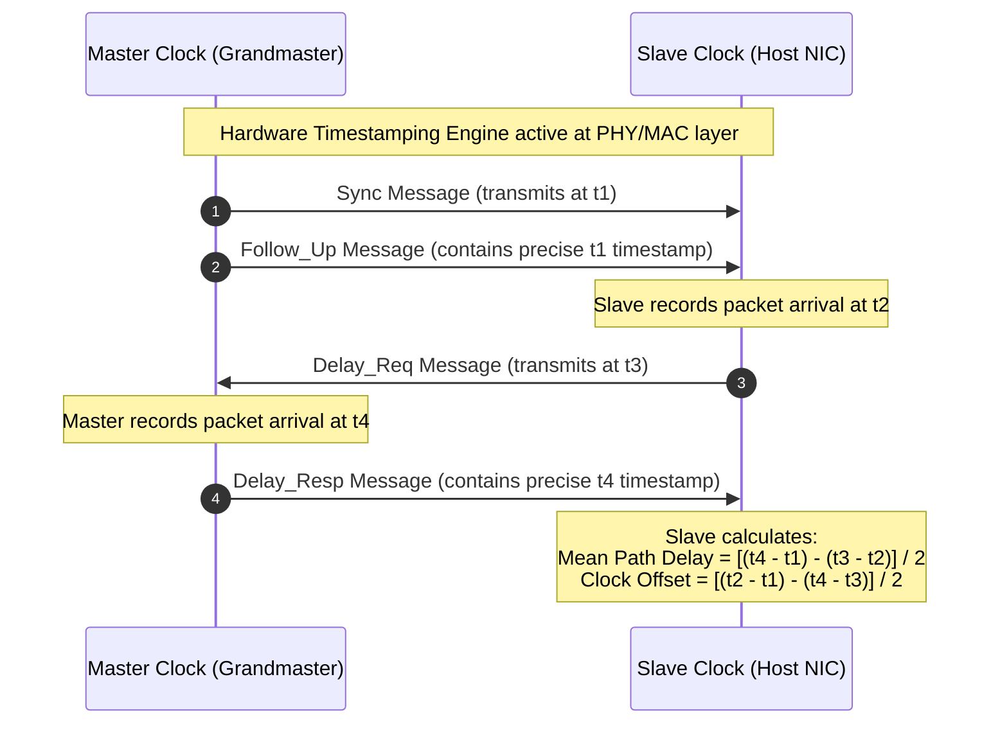
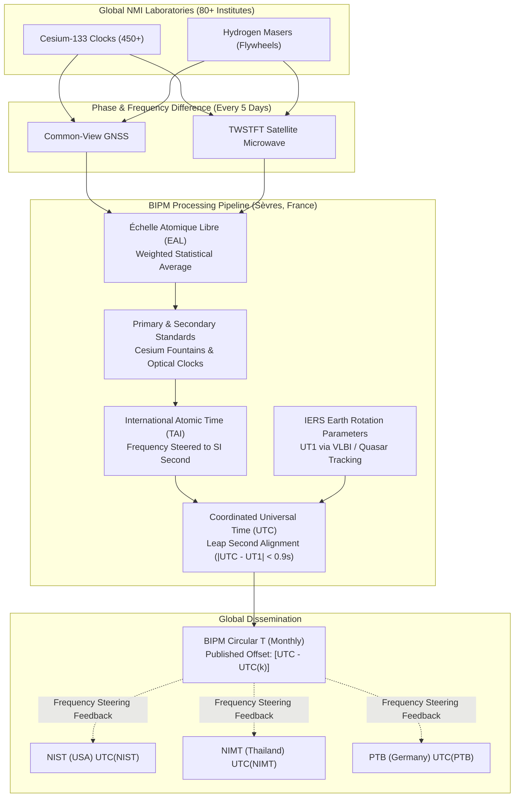
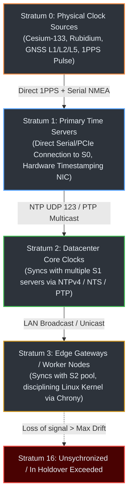
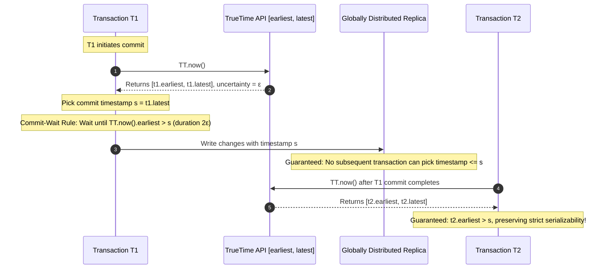

# Mermaid Expert — Time Architecture & Protocol Visualizations

Generates high-clarity, professionally styled Mermaid diagrams for technical articles, systems documentation, and academic publications.

---

## 1. When to Activate This Skill

- When illustrating the hierarchy of network time synchronization (Stratum 0 through Stratum 16).
- When diagramming packet exchanges (NTP 4-timestamp handshake, PTP IEEE 1588v2 two-step master/slave sync).
- When visualizing metrological pipelines (BIPM EAL/TAI/UTC synthesis, Circular T feedback loop).
- When illustrating distributed database causality (Google TrueTime $\epsilon$-uncertainty windows, commit-wait mechanics, Hybrid Logical Clocks).

---

## 2. Pre-Built Time Architecture Templates

### 2.1 PTP (IEEE 1588v2) Two-Step Message Exchange


### 2.2 BIPM Metrological Synthesis Pipeline


### 2.3 Network Stratum Hierarchy


### 2.4 Google Spanner TrueTime Commit-Wait Model


---

## 3. Formatting & Syntax Rules

- **Dark Mode Friendly**: Use dark node fills (`#2d333b`), crisp borders (`#58a6ff`, `#3fb950`, `#f0883e`), and high-contrast text (`#e6edf3`).
- **Autonumber in Sequence Diagrams**: Always enable `autonumber` in sequence diagrams for clear reference in academic text.
- **Escape Characters & Quoting**: Always wrap node labels containing special characters (parentheses, brackets, colons, arithmetic symbols) in double quotes: `id["Label (extra)"]`.
- **Supported Diagram Declarations**: Strictly use supported diagram keywords: `flowchart`, `graph`, `sequenceDiagram`, `stateDiagram-v2`, `classDiagram`, `erDiagram`, `xychart-beta`.

---

## 4. Programmatic Syntax Validator Engine

The skill includes a dedicated syntax and structural validation CLI tool located at:
`scripts/syntax_validator.py`

### Capabilities:
1. **Mermaid Block Verification**:
   - Validates diagram type declarations and unsupported formats.
   - Detects unclosed blocks (`subgraph` ... `end`, `loop` / `alt` / `opt` ... `end`, composite state `{ }`).
   - Detects unquoted special characters in node labels (`()`, `[]`, `{}`) that cause Mermaid parser crashes.
   - Audits edge labels for unclosed pipes (`|`) and malformed arrow heads (`-->-`).
2. **Markdown Table Integrity**:
   - Audits column counts across table header, separator row (`|:---|`), and data rows.
   - Flags missing pipes or column count mismatches.
3. **Code Fence Integrity**:
   - Ensures all code fences (```) are properly matched and closed.

### Usage:
```bash
# Scan entire workspace or a directory:
python3 .agents/skills/mermaid-expert/scripts/syntax_validator.py --path . --strict

# Scan a single document:
python3 .agents/skills/mermaid-expert/scripts/syntax_validator.py --path reports/timing_audit.md

# Output as JSON:
python3 .agents/skills/mermaid-expert/scripts/syntax_validator.py --path kb/ --json
```
