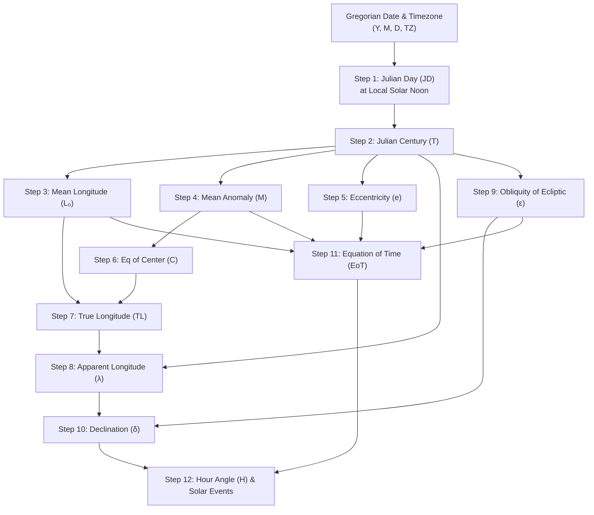

# NOAA Solar Calculator — Solar Mechanics & Sun Times Engine

Calculates solar positions and ephemeris events using the **NOAA Solar Calculator algorithm (Jean Meeus Astronomical Algorithms)**. Delivers deterministic astronomical timing with an accuracy of $\pm 1$ minute across terrestrial latitudes $|\phi| < 72^\circ$.

---

## 1. When to Activate This Skill

- When answering queries about sunrise, sunset, solar noon, or day length for any global coordinates or named locations.
- When computing civil ($96^\circ$), nautical ($102^\circ$), or astronomical ($108^\circ$) twilight boundaries.
- When calculating the Equation of Time ($EoT$), solar declination ($\delta$), or solar azimuth angles at horizon crossing.
- When formatting solar ephemeris tables across dates with dual Buddhist Era (พ.ศ.) and Christian Era (ค.ศ.) calendars.

---

## 2. Theoretical Framework: The 12-Step NOAA / Meeus Algorithm

The engine models Earth's orbital mechanics based on Jean Meeus (*Astronomical Algorithms*, 1998) and the NOAA Global Monitoring Laboratory standards.



### Mathematical Formulations:

1. **Julian Day ($JD$) at Local Solar Noon**:
   For year $Y$, month $M$, day $D$ (if $M \le 2$: $Y \leftarrow Y - 1$, $M \leftarrow M + 12$):
   $$A = \lfloor Y / 100 \rfloor, \quad B = 2 - A + \lfloor A / 4 \rfloor$$
   $$JD_0 = \lfloor 365.25(Y + 4716) \rfloor + \lfloor 30.6001(M + 1) \rfloor + D + B - 1524.5$$
   $$JD = JD_0 + \frac{12 - TZ}{24}$$

2. **Julian Century ($T$)**:
   $$T = \frac{JD - 2451545.0}{36525.0}$$

3. **Geometric Mean Longitude of Sun ($L_0$ in degrees)**:
   $$L_0 = (280.46646 + T(36000.76983 + 0.0003032 T)) \pmod{360^\circ}$$

4. **Geometric Mean Anomaly of Sun ($M$ in degrees)**:
   $$M = 357.52911 + T(35999.05029 - 0.0001537 T)$$

5. **Eccentricity of Earth's Orbit ($e$)**:
   $$e = 0.016708634 - T(0.000042037 + 0.0000001267 T)$$

6. **Sun Equation of Center ($C$ in degrees)**:
   $$C = \sin(M)(1.914602 - T(0.004817 + 0.000014 T)) + \sin(2M)(0.019993 - 0.000101 T) + \sin(3M)(0.000289)$$

7. **Sun True Longitude ($TL$ in degrees)**:
   $$TL = L_0 + C$$

8. **Sun Apparent Longitude ($\lambda$ in degrees)**:
   $$\Omega = 125.04 - 1934.136 T$$
   $$\lambda = TL - 0.00569 - 0.00478 \sin(\Omega)$$

9. **Mean & Corrected Obliquity of Ecliptic ($\epsilon_0, \epsilon$ in degrees)**:
   $$\epsilon_0 = 23^\circ + \frac{26' + \frac{21.448'' - T(46.815'' + T(0.00059'' - 0.001813'' T))}{60}}{60}$$
   $$\epsilon = \epsilon_0 + 0.00256^\circ \cos(\Omega)$$

10. **Solar Declination ($\delta$ in degrees)**:
    $$\delta = \arcsin(\sin(\epsilon) \sin(\lambda))$$

11. **Equation of Time ($EoT$ in minutes)**:
    $$y = \tan^2\left(\frac{\epsilon}{2}\right)$$
    $$EoT = 4 \times \frac{180}{\pi} \left[ y \sin(2 L_0) - 2 e \sin(M) + 4 e y \sin(M) \cos(2 L_0) - 0.5 y^2 \sin(4 L_0) - 1.25 e^2 \sin(2 M) \right]$$

12. **Solar Noon & Hour Angle ($HA$ in degrees)**:
    $$\text{Solar Noon} = 720 - 4 \lambda_{\text{lon}} - EoT + TZ \times 60 \quad (\text{minutes from midnight})$$
    For zenith angle $z$:
    $$\cos(HA) = \frac{\cos(z)}{\cos(\phi) \cos(\delta)} - \tan(\phi) \tan(\delta)$$
    When $|\cos(HA)| \le 1$:
    $$HA = \arccos(\cos(HA))$$
    $$\text{Rise} = \text{Solar Noon} - 4 \times HA, \quad \text{Set} = \text{Solar Noon} + 4 \times HA$$

### Standard Zenith Thresholds:
- **Sunrise / Sunset**: $z = 90.833^\circ$ ($0.567^\circ$ atmospheric refraction $+ 0.266^\circ$ solar semidiameter).
- **Civil Twilight**: $z = 96.0^\circ$ (sun center is $6^\circ$ below geometric horizon).
- **Nautical Twilight**: $z = 102.0^\circ$ (sun center is $12^\circ$ below geometric horizon).
- **Astronomical Twilight**: $z = 108.0^\circ$ (sun center is $18^\circ$ below geometric horizon).

### Solar Azimuth at Rise & Set ($h_0 = -0.833^\circ$):
$$\cos(\text{Azimuth}_{\text{rise}}) = \frac{\sin(\delta) - \sin(\phi) \sin(h_0)}{\cos(\phi) \cos(h_0)}$$
$$\text{Azimuth}_{\text{rise}} = \arccos(\cos(\text{Azimuth}_{\text{rise}})), \quad \text{Azimuth}_{\text{set}} = 360^\circ - \text{Azimuth}_{\text{rise}}$$

---

## 3. Reference Benchmark Verification

The engine is verified against the canonical test case:
- **Coordinates**: Ban Pong, Ratchaburi ($13.8199^\circ\text{ N}, 99.8722^\circ\text{ E}$, $\text{UTC}+7$)
- **Date**: 27 March 2022 (27 มีนาคม พ.ศ. 2565)
- **Results**:
  - Sunrise: `06:19:58`
  - Sunset: `18:31:55`
  - Solar Noon: `12:25:57`
  - Day Length: `12 ชม. 12 นาที`
  - Declination ($\delta$): `+2.5842°`
  - Equation of Time ($EoT$): `-5.4309 min`

---

## 4. Execution & Usage

### Method 1: Bundled Python Engine

```bash
# Calculate solar parameters for coordinates and date
python3 .agents/skills/noaacalc/scripts/noaacalc.py --lat 13.8199 --lon 99.8722 --tz 7 --date 2022-03-27

# Export full calculation variables as JSON
python3 .agents/skills/noaacalc/scripts/noaacalc.py --lat 13.8199 --lon 99.8722 --tz 7 --date 2022-03-27 --json

# Run ground-truth verification benchmark
python3 .agents/skills/noaacalc/scripts/noaacalc.py --benchmark
```

### Method 2: Companion Harness (Relative Path)

If the companion project repository is present alongside this workspace:

```bash
# Natural language query in Thai
python3 ../NOAAcalc/harness.py "พระอาทิตย์ขึ้นที่อำเภอบ้านโป่ง วันที่ 27 มีนาคม 2565 กี่โมง"

# Parametric calculation with verbose 12-step intermediate variables
python3 ../NOAAcalc/harness.py --lat 13.8199 --lon 99.8722 --date 2022-03-27 --verbose
```

---

## 5. Output Formatting Protocol

When presenting solar calculations to the user:
1. **Local Time**: State times explicitly in 24-hour format (`HH:MM:SS` or `HH:MM น.`).
2. **Dual Calendars**: Present dates in both Christian Era (ค.ศ.) and Buddhist Era (พ.ศ., $CE + 543$).
3. **Cartographic Verification**: Provide the direct Google Maps URL:
   `https://www.google.com/maps?q={lat:.6f},{lon:.6f}`
4. **Astronomical Metrics**: When requested, include the solar declination ($\delta$), Equation of Time ($EoT$), solar azimuth, and twilight intervals.
