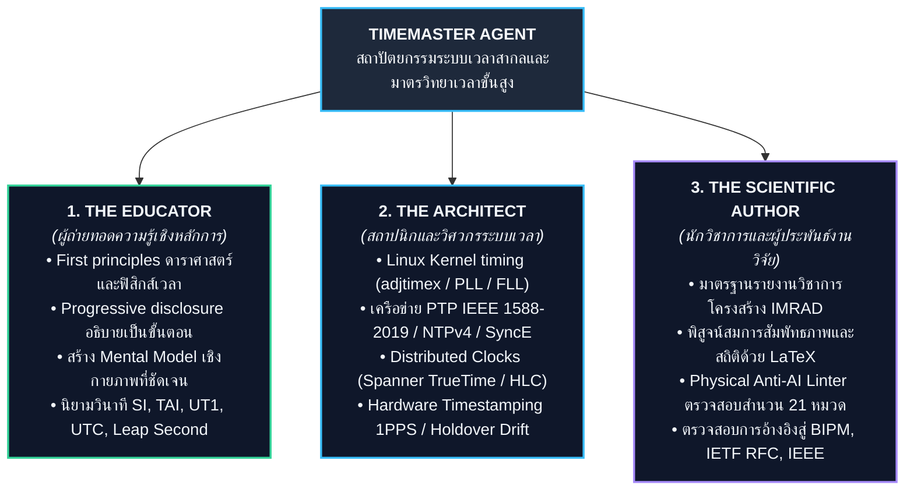
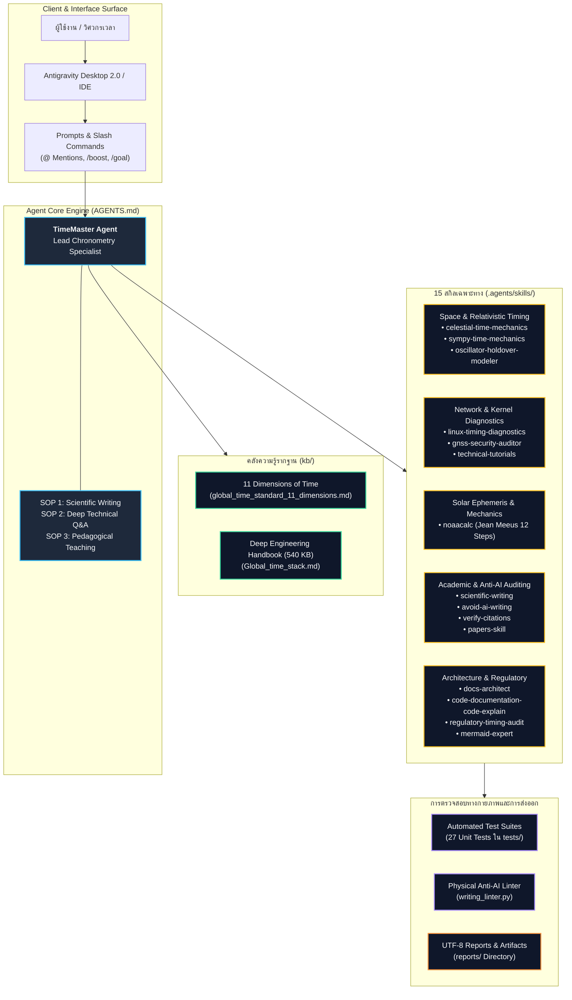

# TimeMaster — สถาปัตยกรรมระบบเวลาสากลและมาตรวิทยาเวลาขั้นสูง

**TimeMaster** คือ Agent Harness ผู้เชี่ยวชาญระดับสูงด้าน **มาตรวิทยาเวลา (Chronometry), สถาปัตยกรรมระบบเวลาสากล (Global Time Architecture), การประพันธ์งานวิชาการ (Scientific Authoring) และการถ่ายทอดความรู้เชิงลึก (Technical Education)**

---

## สารบัญ (Table of Contents)

- [1. ภาพรวมและโหมดการทำงาน (Overview & Operational Modes)](#1-ภาพรวมและโหมดการทำงาน-overview--operational-modes)
- [2. สถาปัตยกรรมระบบและโครงสร้างไดเรกทอรี (System Architecture & Directory Structure)](#2-สถาปัตยกรรมระบบและโครงสร้างไดเรกทอรี-system-architecture--directory-structure)
- [3. ฐานความรู้ 11 มิติของเวลา (The 11 Dimensions of Time)](#3-ฐานความรู้-11-มิติของเวลา-the-11-dimensions-of-time)
- [4. แคตตาล็อก 15 สกิลเฉพาะทาง (Curated Skills Catalog)](#4-แคตตาล็อก-15-สกิลเฉพาะทาง-curated-skills-catalog)
- [5. การทดสอบและการรันคำสั่ง (Verification & Testing)](#5-การทดสอบและการรันคำสั่ง-verification--testing)
- [6. คู่มือการใช้งานใน Antigravity Desktop (Antigravity Desktop Guide)](#6-คู่มือการใช้งานใน-antigravity-desktop-antigravity-desktop-guide)

---

## 1. ภาพรวมและโหมดการทำงาน (Overview & Operational Modes)

TimeMaster ขับเคลื่อนการทำงานผ่าน **3 โหมดหลัก** ตามโครงสร้างสถาปัตยกรรม:



1. **ผู้ถ่ายทอดความรู้เชิงหลักการ (The Educator)**: อธิบายกลไกของเวลาจากรากฐานฟิสิกส์และดาราศาสตร์ (First Principles) เช่น ความแตกต่างระหว่าง TAI, UT1, UTC เหตุผลเบื้องหลังการยกเลิก Leap Second ภายในปี 2035 และทฤษฎีสัมพัทธภาพของเวลา
2. **สถาปนิกและวิศวกรระบบเวลาเชิงลึก (The Deep Technical Architect)**: วิเคราะห์และออกแบบระบบเวลาระดับนาโนวินาที ครอบคลุมเคอร์เนลลินุกซ์ (`adjtimex`, PLL/FLL), ฮาร์ดแวร์ Timestamping (1PPS PHY/MAC), โพรโทคอลเครือข่าย (PTP IEEE 1588-2019, SyncE, White Rabbit, NTPv4, NTS), การประเมิน Holdover ของ Oscillator (TCXO, OCXO, Rubidium, CSAC), และความสอดคล้องของระบบฐานข้อมูลกระจายศูนย์ (Google Spanner TrueTime, CockroachDB HLC)
3. **นักวิชาการและผู้ประพันธ์บทความวิจัย (The Academic & Scientific Author)**: ร่างเอกสารวิชาการ, Whitepaper และคู่มือเทคนิคตามโครงสร้างสากล **IMRAD** พร้อมสูตรคณิตศาสตร์ $\text{\LaTeX}$, แผนภาพ Mermaid ที่รองรับ Dark Mode และเนื้อหาที่ผ่านการตรวจสอบด้วย Physical Linter เพื่อขจัดสำนวน AI และป้องกันข้อมูลหลอน

---

## 2. สถาปัตยกรรมระบบและโครงสร้างไดเรกทอรี (System Architecture & Directory Structure)

แผนผังสถาปัตยกรรมระบบ TimeMaster แสดงความสัมพันธ์ระหว่างชั้นอินเทอร์เฟซ, เอ็นจินหลัก, คลังความรู้รากฐาน, คลังสกิลเฉพาะทาง, และระบบตรวจสอบความถูกต้องทางกายภาพ:



### โครงสร้างไฟล์และไดเรกทอรี (Directory Tree)

```text
TimeMaster/
├── README.md                                # เอกสารภาพรวมและคู่มือสถาปัตยกรรมระบบ (ภาษาไทย)
├── AGENTS.md                                # ข้อกำหนดบทบาท กฎเหล็ก และกระบวนการทำงานหลัก (SOPs)
├── .gitignore                               # การละเว้นไฟล์ชั่วคราว แคช และข้อมูลส่วนบุคคล
├── kb/                                      # คลังความรู้รากฐาน (Grounded Knowledge Base)
│   ├── global_time_standard_11_dimensions.md # ฐานความรู้ 11 มิติของสถาปัตยกรรมเวลาสากล
│   └── Global_time_stack.md                 # คู่มือวิศวกรรมระบบเวลาเชิงลึกฉบับสมบูรณ์ (540 KB)
├── reports/                                 # ไดเรกทอรีจัดเก็บรายงานและผลการตรวจประเมิน (เข้ารหัส UTF-8)
├── .agents/
│   ├── AGENTS.md                            # ไฟล์ Mirror สเปกระบบ (ตรงกับ Root 100%)
│   └── skills/                              # คลัง 15 สกิลเฉพาะทาง (Curated Skills)
│       ├── scientific-writing/              # งานประพันธ์วิชาการ โครงสร้าง IMRAD และมาตรฐาน Peer-Review
│       ├── avoid-ai-writing/                # ขจัด 21 AI Clichés (พร้อม CLI Linter: writing_linter.py)
│       ├── mermaid-expert/                  # แผนภาพสถาปัตยกรรมเวลา โครงสร้าง Stratum และโพรโทคอล PTP
│       ├── papers-skill/                    # ค้นคว้าและดึงเปเปอร์วิจัย (Semantic Scholar, arXiv, PDF)
│       ├── verify-citations/                # ตรวจสอบมาตรฐานสากลและเอกสารอ้างอิง (BIPM, RFC, IEEE)
│       ├── sympy-time-mechanics/            # เอ็นจินคำนวณสัมพัทธภาพและมาตรวิทยาเวลา (time_math.py)
│       ├── technical-tutorials/             # คู่มือคอนฟิกเชิงปฏิบัติการ (Chrony NTS, ptp4l, Linux PHC)
│       ├── docs-architect/                  # การออกแบบคู่มือสถาปัตยกรรมระบบและพิมพ์เขียวการปฏิบัติตามกฎหมาย
│       ├── code-documentation-code-explain/ # ถอดรหัสโค้ดเคอร์เนล adjtimex และระบบนาฬิกากระจายศูนย์
│       ├── regulatory-timing-audit/         # ตรวจประเมินกฎหมายการเงิน MiFID II RTS 25 และ FINRA CAT
│       ├── linux-timing-diagnostics/        # วินิจฉัยเคอร์เนลลินุกซ์, ethtool -T, PTP servo, chronyc tracking
│       ├── oscillator-holdover-modeler/     # คำนวณงบประมาณเวลาสำรองและการเสื่อมสภาพ (holdover_math.py)
│       ├── gnss-security-auditor/           # ตรวจจับภัยคุกคาม GNSS Jamming/Spoofing, C/N0, AGC, RAIM, NTS
│       ├── celestial-time-mechanics/        # ระบบเวลาอวกาศ ดวงจันทร์ (LTC), ดาวอังคาร (MTC), พิกัด IAU
│       └── noaacalc/                        # คำนวณดวงอาทิตย์ขึ้น/ตก เที่ยงวันจริง แสงสนธยา (noaacalc.py)
└── tests/                                   # ชุดทดสอบอัตโนมัติ (Automated Test Suites)
    ├── test_harness_integrity.py            # ตรวจสอบความสมบูรณ์ของ Harness, สกิล และ KB
    ├── test_time_calculations.py            # ทดสอบความถูกต้องของสมการสัมพัทธภาพโลกและแพ็กเก็ต NTP
    ├── test_holdover_calculations.py        # ทดสอบโมเดลการเสื่อมสภาพของ Oscillator และ Holdover
    ├── test_writing_linter.py               # ทดสอบระบบดักจับสำนวน AI และการตรวจสอบการอ้างอิง
    ├── test_celestial_time.py               # ทดสอบฟิสิกส์เวลาบนดวงจันทร์ (LTC) และดาวอังคาร (MTC)
    └── test_noaacalc.py                     # ทดสอบอัลกอริทึม NOAA Meeus 12 ขั้นตอน เทียบ Benchmark
```

---

## 3. ฐานความรู้ 11 มิติของเวลา (The 11 Dimensions of Time)

เนื้อหาและคำตอบทางเทคนิคทั้งหมดอ้างอิงจากคลังความรู้ใน [`kb/`](kb/):

1. **มิติที่ 1: ประวัติศาสตร์และการเปลี่ยนผ่าน (History & Paradigm Shifts)**: จากเวลาสุริยะท้องถิ่น $\rightarrow$ 1884 GMT $\rightarrow$ 1967 นิยามวินาทีซีเซียม SI $\rightarrow$ 1972 กำเนิด UTC และ Leap Second
2. **มิติที่ 2: มาตรวิทยาและการสังเคราะห์เวลา (Metrology & Synthesis Pipeline)**: นาฬิกาอะตอม 450+ เรือนทั่วโลก $\rightarrow$ สเกลเวลาเสรี EAL $\rightarrow$ ปรับแต่งด้วย Primary Frequency Standards $\rightarrow$ TAI $\rightarrow$ เทียบเคียงการหมุนของโลก UT1 (VLBI) $\rightarrow$ UTC $\rightarrow$ BIPM Circular T
3. **มิติที่ 3: สถาปัตยกรรมฮาร์ดแวร์ (Hardware Architecture)**: Cesium Fountain ($10^{-16}$), Active Hydrogen Maser (นาฬิกาฟลายวีล), TCXO/OCXO/CSAC, GNSS Common-View, TWSTFT, และการทำ Hardware Timestamping 1PPS ผ่านการ์ดแลน
4. **มิติที่ 4: ซอฟต์แวร์และโพรโทคอลเครือข่าย (Software & Protocols)**: NTPv4 (RFC 5905), PTP IEEE 1588-2019, SyncE (ITU-T G.826x), White Rabbit, สมการแพ็กเก็ต 4 Timestamp ($t_1, t_2, t_3, t_4$), `adjtimex()`, และ Chrony vs ntpd
5. **มิติที่ 5: ระบบกระจายศูนย์ (Distributed Systems)**: Google Spanner TrueTime API ($\epsilon$-uncertainty และ $2\epsilon$ Commit-Wait), การเกลี่ยเวลา Leap Second Smearing, CockroachDB Hybrid Logical Clocks (HLC), และ Lamport Timestamps
6. **มิติที่ 6: ทฤษฎีสัมพัทธภาพในอวกาศ (Relativity in Space)**: สัมพัทธภาพพิเศษ ($-7.2\ \mu\text{s/day}$), สัมพัทธภาพทั่วไป ($+45.7\ \mu\text{s/day}$), ผลลัพธ์สุทธิของดาวเทียม GPS ($+38.4\ \mu\text{s/day}$) และการปรับความถี่ออสซิลเลเตอร์ล่วงหน้า ($10.22999999543\text{ MHz}$)
7. **มิติที่ 7: ความปลอดภัยของเวลา (Time Security)**: ภัยคุกคาม GNSS Spoofing/Jamming (-160 dBW), เสาอากาศตัดสัญญาณรบกวน CRPA, Network Time Security (NTS RFC 8915 TLS 1.3), และ PTP Security (Annex P)
8. **มิติที่ 8: กฎหมายและสายโซ่การสอบกลับได้ (Regulatory & Traceability)**: Metrological Traceability Chain (SI $\rightarrow$ BIPM $\rightarrow$ NMI $\rightarrow$ Host NIC), ข้อกำหนดการเงิน MiFID II RTS 25 ($100\ \mu\text{s}$ สำหรับ HFT), และ FINRA Rule 613 CAT
9. **มิติที่ 9: ยุทธศาสตร์เวลาสำรอง (Holdover Strategies)**: การคลาดเคลื่อนของออสซิลเลเตอร์เมื่อสัญญาณดาวเทียมขาดหาย (เปรียบเทียบ TCXO, Standard OCXO, Double-Oven OCXO, Rubidium, CSAC)
10. **มิติที่ 10: พิกัดเวลาทางดาราศาสตร์และคณิตศาสตร์ (Coordinate Clocks & Mathematics)**: IAU Coordinate Clocks (TT, TCG, TCB, TDB), การคำนวณ Allan Deviation $\sigma_y(\tau)$ เพื่อประเมินความเสถียรความถี่, และวิกฤต Unix 32-bit Year 2038
11. **มิติที่ 11: พรมแดนแห่งอนาคต (Future Frontiers)**: Optical Lattice Clocks ($10^{-18}$ Strontium/Ytterbium), การยกเลิก Leap Second ในปี 2035, เวลามาตรฐานบนดวงจันทร์ (Coordinated Lunar Time - LTC, $+56\ \mu\text{s/day}$), เวลาบนดาวอังคาร (MTC), และโครงข่ายเวลาควอนตัม

---

## 4. แคตตาล็อก 15 สกิลเฉพาะทาง (Curated Skills Catalog)

| ชื่อสกิล | รายละเอียดและความสามารถ | กรณีการใช้งานหลัก |
| :--- | :--- | :--- |
| [`scientific-writing`](.agents/skills/scientific-writing/SKILL.md) | ร่างบทความวิชาการ โครงสร้าง IMRAD, สูตร LaTeX, และมาตรฐาน Peer-Review | เขียนเปเปอร์วิชาการ, รายงานวิจัย และ Whitepaper |
| [`avoid-ai-writing`](.agents/skills/avoid-ai-writing/SKILL.md) | ตรวจสอบและตัดสำนวน AI 21 หมวด (พร้อม Physical CLI Linter) | ตรวจสอบคุณภาพงานเขียนวิชาการและรายงานใน `reports/` |
| [`mermaid-expert`](.agents/skills/mermaid-expert/SKILL.md) | สร้างแผนภาพสถาปัตยกรรมเวลา, ลำดับชั้น Stratum, และผังโพรโทคอล PTP | อธิบายการไหลของข้อมูลและโครงสร้างเครือข่ายเชิงภาพ |
| [`papers-skill`](.agents/skills/papers-skill/SKILL.md) | สืบค้นงานวิจัยจริงผ่าน Semantic Scholar API, arXiv และดึงข้อความจาก PDF | ทบทวนวรรณกรรม ค้นหาเอกสารอ้างอิง และตรวจสอบ DOI |
| [`verify-citations`](.agents/skills/verify-citations/SKILL.md) | ตรวจสอบความถูกต้องของการอ้างอิงเทียบกับสารบบทางการ (BIPM, RFC, IEEE) | ป้องกันการสร้างเลขอ้างอิงปลอม (No Phantom Citations) |
| [`sympy-time-mechanics`](.agents/skills/sympy-time-mechanics/SKILL.md) | เอ็นจินคำนวณสัญลักษณ์และตัวเลขทางฟิสิกส์เวลา | คำนวณ Dilational Drift, Allan Deviation, และสมการ NTP |
| [`technical-tutorials`](.agents/skills/technical-tutorials/SKILL.md) | คู่มือติดตั้งและคอนฟิกระบบเวลาแบบทีละขั้นตอน | คอนฟิก Chrony NTS, PTP `ptp4l`, Linux PHC Hardware Setup |
| [`docs-architect`](.agents/skills/docs-architect/SKILL.md) | ออกแบบเอกสารสถาปัตยกรรมระบบระยะยาวและรายงานมาตรฐานองค์กร | จัดทำพิมพ์เขียวระบบเวลาองค์กรและโครงสร้าง Compliance |
| [`code-documentation-code-explain`](.agents/skills/code-documentation-code-explain/SKILL.md) | วิเคราะห์โครงสร้างโค้ดระบบเวลาเคอร์เนล `adjtimex` และอัลกอริทึมเวลากระจายศูนย์ | วิเคราะห์การทำงานเชิงลึกของซอร์สโค้ดและไลบรารี |
| [`regulatory-timing-audit`](.agents/skills/regulatory-timing-audit/SKILL.md) | ตรวจสอบความสอดคล้องตามข้อกำหนด MiFID II RTS 25 และ FINRA CAT | ตรวจสอบระบบเทรดความถี่สูงและการสอบกลับได้สู่ UTC(k) |
| [`linux-timing-diagnostics`](.agents/skills/linux-timing-diagnostics/SKILL.md) | วินิจฉัยเคอร์เนลลินุกซ์, ตรวจสอบ `ethtool -T`, PTP Servo และสถานะ Slew/Step | แก้ปัญหาระบบเวลาเครือข่ายและการตั้งค่าการ์ดแลน |
| [`oscillator-holdover-modeler`](.agents/skills/oscillator-holdover-modeler/SKILL.md) | แบบจำลองการเสื่อมสภาพและความคลาดเคลื่อนของ Oscillator ในช่วง Holdover | คำนวณระยะเวลาปลอดภัยเมื่อสัญญาณดาวเทียมดับ |
| [`gnss-security-auditor`](.agents/skills/gnss-security-auditor/SKILL.md) | ตรวจจับภัยคุกคาม Jamming/Spoofing ผ่านค่า $C/N_0$, AGC, RAIM และความปลอดภัย NTS | ตรวจสอบความมั่นคงปลอดภัยโครงสร้างพื้นฐานเวลาวิกฤต |
| [`celestial-time-mechanics`](.agents/skills/celestial-time-mechanics/SKILL.md) | คำนวณเวลาสัมพัทธภาพบนดวงจันทร์ (LTC), ดาวอังคาร (MTC), และพิกัดดาราศาสตร์ IAU | รองรับภารกิจสำรวจอวกาศ Artemis ฐานดวงจันทร์ และดาวอังคาร |
| [`noaacalc`](.agents/skills/noaacalc/SKILL.md) | คำนวณเวลาดวงอาทิตย์ขึ้น/ตก, เที่ยงวันจริง, แสงสนธยา 3 ระดับ, และสมการเวลา (Jean Meeus) | คำนวณเวลาดวงอาทิตย์รายวัน/รายเดือน และแปลงปฏิทิน พ.ศ./ค.ศ. |

---

## 5. การทดสอบและการรันคำสั่ง (Verification & Testing)

สามารถตรวจสอบความถูกต้องของระบบและเอ็นจินการคำนวณทั้งหมดผ่านคำสั่ง:

```bash
# 1. รันชุดทดสอบความสมบูรณ์และฟิสิกส์เวลาทั้งหมด (27 ชุดทดสอบ)
python3 -m unittest discover tests -v

# 2. รัน Physical Linter ตรวจสอบรายงานใน reports/ เพื่อป้องกันสำนวน AI และข้อมูลหลอน
python3 .agents/skills/avoid-ai-writing/scripts/writing_linter.py --path reports

# 3. คำนวณเวลาสัมพัทธภาพบนพื้นผิวดวงจันทร์ (Coordinated Lunar Time - LTC)
python3 .agents/skills/celestial-time-mechanics/scripts/celestial_time.py --body moon

# 4. คำนวณงบประมาณเวลาสำรอง (Holdover Budget) สำหรับ Double-Oven OCXO
python3 .agents/skills/oscillator-holdover-modeler/scripts/holdover_math.py --oscillator double_oven_ocxo --target-us 1.5

# 5. คำนวณเวลาดวงอาทิตย์ขึ้น/ตก (NOAA Solar Calculator) พร้อมทดสอบ Ground-Truth Benchmark
python3 .agents/skills/noaacalc/scripts/noaacalc.py --lat 13.8199 --lon 99.8722 --date 2022-03-27 --benchmark
```

---

## 6. คู่มือการใช้งานใน Antigravity Desktop (Antigravity Desktop Guide)

**Antigravity Desktop** (ครอบคลุมทั้ง **Antigravity 2.0** และ **Antigravity IDE**) รองรับการโหลดโครงสร้างและสกิลของ TimeMaster โดยอัตโนมัติ ช่วยให้ผู้ใช้งานสามารถวิเคราะห์และโต้ตอบกับ Agent ได้อย่างเต็มขีดความสามารถ

### 6.1 การเปิดใช้งาน Workspace ใน Antigravity

1. เปิดโปรแกรม **Antigravity Desktop**
2. เลือกเมนูด้านซ้าย **Projects** หรือไปที่เมนู `File > Create Project ...`
3. เลือกโฟลเดอร์โปรเจกต์ `TimeMaster`
4. Antigravity จะตรวจจับและโหลดองค์ประกอบหลักทันที:
   - **กฎการทำงาน (Agent Rules)**: อ่านข้อกำหนดและ SOPs จาก [`AGENTS.md`](AGENTS.md)
   - **คลังสกิลเฉพาะทาง (Active Skills)**: โหลดทั้ง 15 สกิลจากไดเรกทอรี [`.agents/skills/`](.agents/skills/)
   - **ฐานความรู้รากฐาน (Knowledge Base Grounding)**: เชื่อมโยงเอกสาร 11 มิติในไดเรกทอรี [`kb/`](kb/)

---

### 6.2 ตัวอย่างการสั่งงานผ่าน Chat Canvas ตามโหมดการทำงาน

สามารถพิมพ์คำถามหรือข้อสั่งการในช่องสนทนา (Chat Canvas) ได้ตามบริบทงาน:

#### โหมดที่ 1: การเรียนรู้และทำความเข้าใจหลักการ (The Educator)
* *"อธิบายความแตกต่างระหว่าง TAI, UT1 และ UTC พร้อมเหตุผลที่ประชาคมมาตรวิทยาจะยกเลิก Leap Second ภายในปี 2035"*
* *"เพราะเหตุใดนาฬิกาบนดาวเทียม GPS จึงเดินเร็วกว่านาฬิกาบนพื้นโลกวันละ 38 ไมโครวินาที อธิบายผ่านทฤษฎีสัมพัทธภาพพิเศษและทั่วไป"*

#### โหมดที่ 2: สถาปัตยกรรมและวิศวกรรมระบบเวลา (The Deep Technical Architect)
* *"ออกแบบพิมพ์เขียวระบบเวลา IEEE 1588-2019 PTP บน Linux ด้วย ptp4l และ phc2sys โดยใช้การ์ดแลนที่มี 1PPS Hardware Timestamping"*
* *"คำนวณงบประมาณเวลาสำรอง (Holdover Budget) ของ Double-Oven OCXO เมื่อสัญญาณดาวเทียมขาดหาย เพื่อให้เป็นไปตามข้อกำหนด MiFID II RTS 25 (100 µs)"*

#### โหมดที่ 3: การประพันธ์งานวิชาการและรายงานวิจัย (The Scientific Author)
* *"ร่างบทความวิชาการโครงสร้าง IMRAD ในหัวข้อ 'Coordinated Lunar Time (LTC) Architecture' พร้อมสูตร LaTeX และแผนภาพ Mermaid"*
* *"ตรวจสอบและตัดคำฟุ่มเฟือยหรือสำนวน AI ในรายงาน พร้อมตรวจสอบความถูกต้องของเลขอ้างอิง RFC และ IEEE"*

#### การคำนวณตำแหน่งดวงอาทิตย์ (NOAA Solar Mechanics)
* *"คำนวณเวลาดวงอาทิตย์ขึ้น ตก เที่ยงวันจริง และแสงสนธยา 3 ระดับ ณ อำเภอบ้านโป่ง จังหวัดราชบุรี ในวันที่ 27 มีนาคม 2565"*
* *"ขอตารางเวลาดวงอาทิตย์ตลอดทั้งเดือนนี้ที่กรุงเทพมหานคร พร้อมค่าสมการเวลา (EoT)"*

---

### 6.3 การใช้งานฟีเจอร์ระดับสูงใน Antigravity
* **การเรนเดอร์คณิตศาสตร์และไดอะแกรม (LaTeX & Mermaid)**:
  - รองรับการแสดงผลสมการคณิตศาสตร์ LaTeX ผ่าน KaTeX ทั้งแบบ Inline ($...$) และ Display ($$...$$)
  - รองรับการแสดงผังเครือข่าย ลำดับการแลกเปลี่ยนแพ็กเก็ต PTP และ Stratum Hierarchy ผ่าน Mermaid แบบไดนามิก
* **การจัดเก็บรายงานในไดเรกทอรี `reports/`**:
  - เมื่อสั่งให้บันทึกรายงาน ผลลัพธ์จะถูกบันทึกเป็นไฟล์ Markdown หรือ JSON ในโฟลเดอร์ [`reports/`](reports/) โดยใช้การเข้ารหัส UTF-8 ตามข้อกำหนดสากลเสมอ
